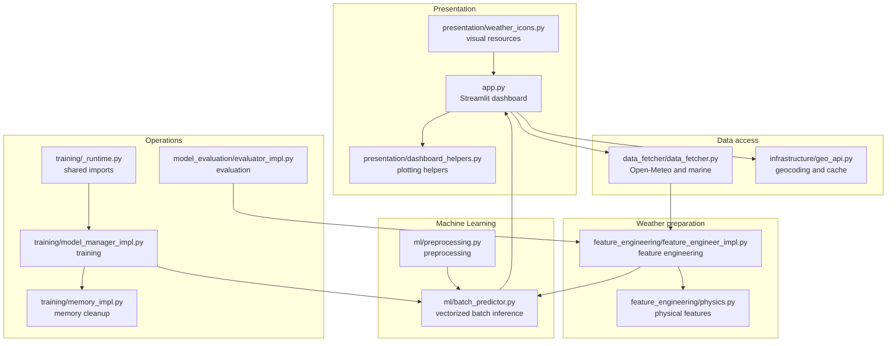

# Weather Forecast Architecture

## 1. Objectives

Weather Forecast is organized around explicit responsibilities: data
collection, feature preparation, inference, and training are
separated, while the root modules retain the historical entry points.

This organization preserves the expected business behaviors while improving:
- readability and localization of the code;
- reuse in Streamlit, scripts, notebooks, and CI jobs;
- offline testability;
- portability of paths on Linux, macOS, and Windows;
- control over the lifecycle of models and memory.

## 2. Overview


## 3. Dependency Principles

### Meteorological Preparation

The modules in `feature_engineering/` receive data and parameters and
return DataFrames or calculated values. Astronomical, physical, climatological, and lag calculations remain separate from the interface.

### Infrastructure and data

`infrastructure/` and `data_fetcher/` contain side effects: HTTP,
JSON cache, configuration, geolocation, and response merging. The
requests are isolated so that they can be replaced with mocked sessions in the
tests.

### Machine Learning
`ml/` contains preprocessing, stacking, and prediction. The serializable facades retain the historical names used by the Joblib artifacts.

### Training

The modules in `training/` share their common technical dependencies via
`training/_runtime.py`. This hub groups the imports used by the pipeline,
the models, Optuna, LightGBM, and memory management, in order to avoid
repeating the same imports at the beginning of each module.

### Presentation

The presentation collects user inputs and displays the outputs. Feature calculations and predictions remain in their respective packages. The dashboard helpers keep chart generation and date formatting separate from the main UI flow so the Streamlit page stays easier to follow.

## 4. Path and artifact resolution

`infrastructure/config.py` is the source of truth for configuration,  
API constants, project paths, and artifacts. Persistent files used by inference are resolved relative to the project, and not to the  
current working directory of the command.

The main artifacts are :

```text
weather_app/
|-- binary/
	|-- global_meta.pkl
	|-- geo_cache.json
	|-- model_temp_short.pkl
	|-- model_temp_medium.pkl
	|-- model_temp_long.pkl
	|-- model_precip_prob_short.pkl
	|-- ...
```

The bundles contain the model, the expected features, the bias correctors and, when necessary, the quantile models.

## 5. Data Flow

1. Streamlit asks the user for a city or a location.  
2. `infrastructure.geo_api` reads the cache or uses the geocoding service.  
3. `DataFetcher` retrieves hourly weather and marine data.  
4. `FeatureEngineer` reindexes the series and adds climatology, cycles, physics and lags.  
5. The predictor loads the expected metadata and bundles.  
6. `BatchWeatherPredictor` builds a matrix for all horizons.  
7. The outputs are bounded and use the current observation as a fallback.
8. The presentation renders the results without recalculating the business logic.

## 6. Preserved business contracts

- The Open-Meteo forecast uses `past_days=7` and `forecast_days=2`.
- The archives use ERA5 and a period ending a few days before the current date.
- The horizons are grouped into `short`, `medium` and `long` blocks.
- The variables `hum` and `cloud` are bounded between 0 and 100.
- The pressure is bounded between 300 and 1200 hPa.
- The quantities of rain, wind, gusts and tide are not negative.
- An unavailable prediction falls back to the corresponding observation.
- Chronological imputation never looks at a future value.  
- The cleanup `gc.collect()` and `malloc_trim(0)` is attempted after heavy processing.  ## 7. Testability  

The tests are organized around the following boundaries:  

| Boundary | Test substitution |
| --- | --- |
| Weather API| Geocoding | simulated session or response |
| Joblib | dummy artifacts and models |
| Models | sklearn objects with `predict` || File system | `tmp_path` pytest |
| Architecture | testing facades, packages and size limits |

No unit test requires an Internet connection, a heavy model, or an absolute path specific to the development machine.

## 8. Compatibility
The root-level scripts (`config.py`, `inference.py`, `models.py`, `train.py`, `eval_model.py`) act as compatibility entry points and preserve the historical import paths expected by older scripts and notebooks.

The main business objects are:

- `FeatureEngineer` in `feature_engineering/feature_engineer_impl.py`;
- `InplacePredictPreprocessor` and `TimeSeriesStackingRegressor` in `ml/models_impl.py`;
- `WeatherPredictor` in `ml/weather_predictor_impl.py`;
- `ModelManager` in `training/model_manager_impl.py`.

The new regular modules target a limit of 300 lines. The few historical orchestrators exceeding this limit are explicit in the architecture test to avoid any modification of business logic.

The oversized modules are:

- `infrastructure/config.py`
- `data_fetcher/data_fetcher.py`
- `feature_engineering/physics.py`
- `ml/batch_predictor.py`
- `presentation/dashboard_helpers.py`
- `training/training_loop.py`
- `training/stacking_impl.py`

`ml/batch_predictor.py` remains intentionally larger because it contains the vectorized batch inference logic for all horizons and the precipitation-specific prediction path. `presentation/dashboard_helpers.py` is similarly treated as an exception because it centralizes the plotting logic for the Streamlit dashboard and keeps the UI entry point smaller and easier to follow. These modules are explicitly treated as exceptions to the regular line limit to avoid introducing unnecessary fragmentation when the domain logic is naturally grouped.

## 9. Future extension

A new weather source must be added as an adapter in
`data_fetcher/` or `infrastructure/` rather than duplicating the data preparation.