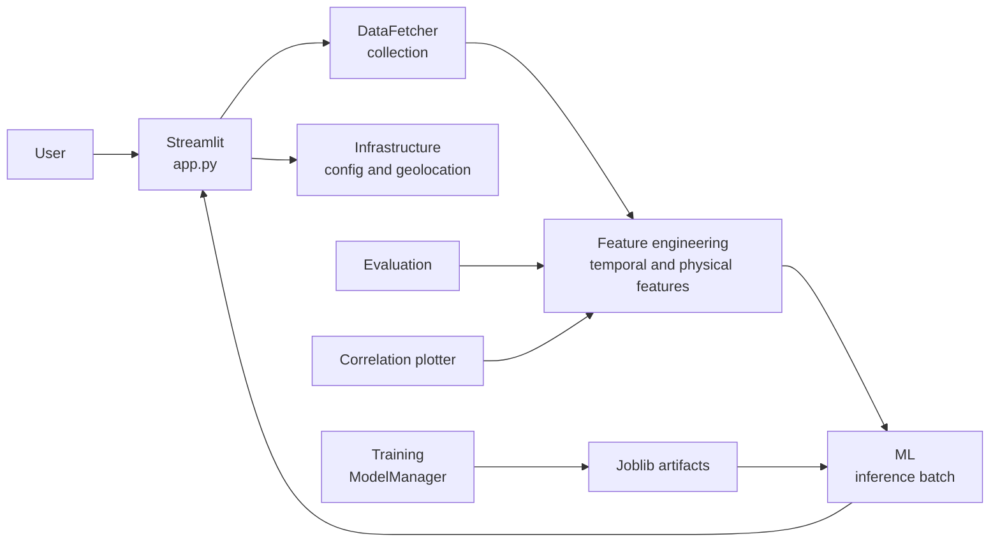
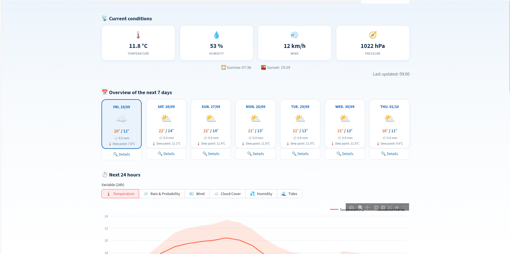
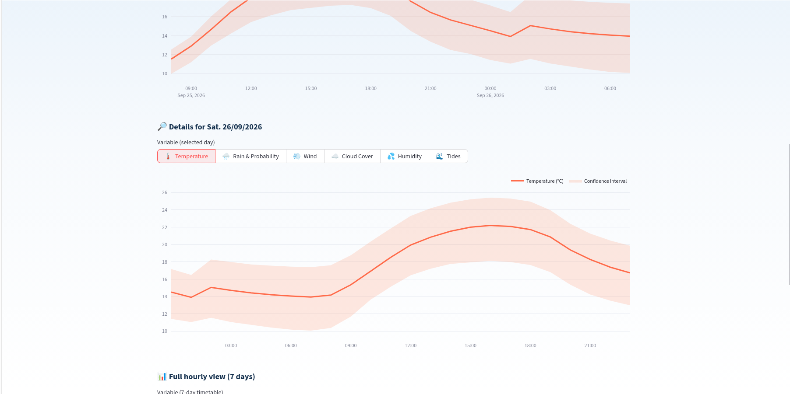
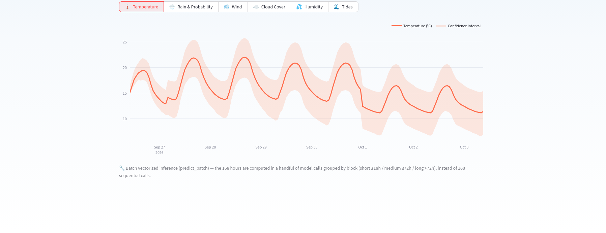

# Weather Forecast

[](https://www.python.org/)
[](https://streamlit.io/)
[](https://scikit-learn.org/)
[](https://pytest.org/)
[](LICENSE)

Weather Forecast is a local weather forecasting application based on machine learning, Open-Meteo data, and atmospheric-physics indicators. It prepares hourly series, produces multi-horizon forecasts, and displays the results in a Streamlit interface.

> Educational and experimental project: the forecasts do not replace official alerts nor the expertise of a national meteorological service.
>If this project has helped you or if you find it interesting, please feel free to like it or leave a comment.

## Summary

- [Problem and solution](#problem-and-solution)
- [Specifications](#specifications)
- [Features](#features)
- [Architecture](#architecture)
- [File structure](#file-structure)
- [Installation](#installation)
- [Data and models](#data-and-models)
- [Usage](#utilisation)
- [Tests and quality](#tests-and-quality)
- [Images](#images)
- [Troubleshooting](#troubleshooting)
- [License](#license)
- [Possible improvements](#possible-improvements)

## Problem and solution

### Problem

Numerical models and regional-resolution meteorological data can retain local biases related to orography, microclimates, the urban environment, and diurnal cycles. Raw outputs must also be prepared consistently before being consumed by an ML model.

### Solution

Weather Forecast combines:

1. Hourly Open-Meteo data in forecast, archive, and marine mode.  
2. Temporal preparation with reindexing, climatology, and cyclic variables.  
3. Physical features: VPD, specific humidity, K-Index, vector wind, and solar elevation.  
4. Models per target and per temporal block, consumed by a batch inference.  
5. Physical bounds, fallbacks, and explicit memory management.

## Specifications

| Element | Value |
| --- | --- |
| Language | Python 3.10 or higher |
| Interface | Streamlit |
| Sources | Open-Meteo, local data and injectable geocoding |
| Targets | temperature, humidity, pressure, wind, precipitation, clouds, dew, gusts, tide |
| Horizons | short, medium and long |
| Models | Joblib bundles; scikit-learn-compatible stacking |
| Tests | pytest, network-free tests, and simulated heavy models |
| License | MIT, see [LICENSE](LICENSE) |

## Features

- Vectorized batch forecasting for multiple horizons.
- Open-Meteo correction with `forecast_days=2` to include the current day and the next day.
- Vectorized calculation of solar elevation and sunrise/sunset times.
- Monthly and hourly climatology, anomalies, and cyclic encodings.
- Hourly lags.
- Chronological imputation without leakage from the future to the past.
- Safety bounds for humidity, pressure, temperature, rain, wind, and clouds.
- Fallback to the current observation when a model is missing or has failed.
- RAM cleanup via `gc` and `malloc_trim` when the platform allows it.
- Unit tests without real network calls or loading of heavy models.

## Architecture

The details of responsibilities, dependencies, and flows are documented in
[ARCHITECTURE.md](ARCHITECTURE.md).



## File structure

```text
weather_app/
|-- app.py                         # Streamlit dashboard entry point
|-- config.py                      # Historical compatibility facade
|-- inference.py                   # Compatibility facade for batch inference
|-- models.py                      # Facade for serialized model classes
|-- train.py                       # Legacy training entry point
|-- eval_model.py                  # Evaluation entry point
|-- utils_features.py              # Utility facade for feature services
|-- plot_correlations.py           # Analysis helper entry point
|-- infrastructure/                # Configuration, logging, geolocation
|-- data_fetcher/                  # Open-Meteo fetchers and data merge logic
|-- feature_engineering/           # Temporal, astronomical and physical features
|-- ml/                            # Preprocessing, stacking and inference
|-- training/                      # Training pipeline and runtime helpers
|-- model_evaluation/              # Metrics and evaluation flows
|-- correlation_plotter/           # Plotting and correlation analysis
|-- presentation/                  # Weather icons and dashboard helpers
|-- tests/                         # Unit and architecture tests
|-- README.md
|-- ARCHITECTURE.md
|-- LICENSE
```

## Installation

```bash
python3 -m venv .venv
source .venv/bin/activate
python3 -m pip install --upgrade pip
python3 -m pip install -r requirements.txt
```

Optional training libraries are required only for the corresponding jobs.

## Data and models

The paths for data, geographic cache, and artifacts are centralized by `infrastructure/config.py`. The files used for inference include, among others:

```text
weather_app/
|-- binary/
    |-- global_meta.pkl
    |-- geo_cache.json
	|-- model_temp_short.pkl
	|-- model_temp_medium.pkl
    |-- model_temp_long.pkl
	|-- model_precip_prob_short.pkl
    |-- ...
```

The repository does not necessarily provide all trained models. The file
`global_meta.pkl` must contain the expected features and, when necessary,
the climate references.

## Usage
### Streamlit Interface

```bash
streamlit run app.py
```

The interface retrieves the data, prepares the features, and displays the available predictions.

### Training

```bash
python3 train.py --city Paris
```

The models are produced per target
and per time block according to the project's configuration.

### Integration in Python code
```python
from training.pipeline import main

main()
```

### Environment and local execution
```bash
python3 -m streamlit run app.py
```

### Evaluation and analysis

```bash
python3 eval_model.py \
	--base-dir ./binary \
	--data ./binary/full_grid_archive.parquet \
	--cutoff-date 2024-01-01
python3 plot_correlations.py
```

The evaluation paths are configurable and default to the directory defined by
`WeatherConfig.BASE_DIR`. The scripts can also be used from a notebook or a CI job.

## Tests and quality

Run the full suite:
```bash
python3 -m pytest -q tests
python3 -m compileall -q .
python3 -m ruff check .
```

CI is executed on GitHub Actions for each push and pull request. The workflow runs the same commands as above and protects the project from regressions on the supported Python version.

The tests cover atmospheric physics, solar calculations, data
preparation, Open-Meteo parsing, inference fallbacks, physical
bounds, compatibility facades, and package architecture.
The HTTP network is replaced by mocked sessions and no large
model is required.

## Images







## Troubleshooting

- **No model found**: verify that `global_meta.pkl` and the expected bundles exist.
- **Models not included in the repository**: the Streamlit interface now displays
	an explanatory message. Train the models locally and place the generated
	artifacts in the configured model directory.
- **City not found**: check the geocoding and the `geo_cache.json` cache.
- **`malloc_trim` unavailable**: normal behavior on platforms that do not expose it.
- **Memory crash**: Try closing other applications or use a hosted environment such as [Google Colab](https://colab.research.google.com)
or [Kaggle](https://kaggle.com)
- **Import from an external script**: run from the project root or configure the Python environment.
- **Missing API data**: network errors are handled by retries, and the predictor uses the available observations.
- **429 error with the data fetching**: Use a VPN ([ProtonVPN](https://protonvpn.com/) ).

## Possible improvements 
- **Tide forecasting**: Improve tide forecasting to detect bodies of water within a certain distance and train a model on this data.
- **Architecture**: Optimise the project architecture.
- **Feature engineering**: Improve feature engineering, such as removing unnecessary columns or combining several columns

## License

Weather Forecast is distributed under the MIT license. See [LICENSE](LICENSE).